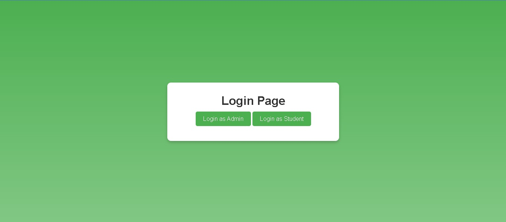

# Faculty Feedback System

## Overview
The Faculty Feedback System is a Spring Boot-based project designed to streamline the process of collecting and analyzing feedback for faculty members. The application features two distinct user roles: **Admin** and **Student**, each with specific functionalities. 

The backend is developed using **Spring Boot** and **STS (Spring Tool Suite)**, while the frontend is created using **Visual Studio Code (VSCode)**. **CORS (Cross-Origin Resource Sharing)** is implemented to integrate the frontend and backend seamlessly.

## Features
### Admin Features:
- Add Faculty
- Delete Faculty
- Modify Faculty Information
- View Faculty Performance

### Student Features:
- Login using a common username and password
- Provide feedback for selected faculty members
- Feedback is directly linked to the corresponding faculty’s performance data

This system helps faculty members identify areas for improvement based on student feedback.

---

## Installation

### Prerequisites
- **Java JDK 11+**
- **Spring Tool Suite (STS)**
- **Node.js** and **npm**
- **Visual Studio Code (VSCode)**
- **MySQL Database**

### Steps
1. Clone the repository:
   ```bash
   git clone https://github.com/your-repo/faculty-feedback-system.git
   ```
2. Import the backend project into STS.
3. Install frontend dependencies:
   ```bash
   cd frontend
   npm install
   ```
4. Update the database configuration in the backend `application.properties` file.
5. Start the backend server from STS.
6. Start the frontend server:
   ```bash
   npm start
   ```
7. Access the application at `http://localhost:3000`.

---

## Screenshots and Outputs

### 1. Login Page
The login page provides two options:
- Admin Login
- Student Login



### 2. Admin Dashboard
Upon successful login as an admin, the dashboard displays options to manage faculty and view performance.


### 3. Add/Modify/Delete Faculty
Admin can add, modify, or delete faculty details using the provided forms.

### 4. View Faculty Performance
Admins can view a performance bar graph indicating the feedback received for each faculty member.


### 5. Student Feedback Form
Students can select a faculty member and provide feedback using an intuitive form.


### 6. Feedback Submission Confirmation
After submitting feedback, a confirmation message is displayed.

---

## Technology Stack
- **Frontend:** HTML, CSS, JavaScript (React.js)
- **Backend:** Spring Boot (Java)
- **Database:** MySQL
- **Tools:** STS, VSCode

---
